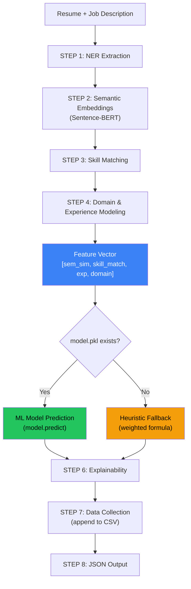

# ML Pipeline Conversion Report

## Conversion: Rule-Based → Data-Driven ML Model

The scoring system has been successfully converted from a **hardcoded weighted formula** to a **trained machine learning model** with automatic data collection.

---

## Validation Results

| Test Case | Heuristic | ML Model | Delta |
|---|---|---|---|
| ML Engineer JD vs Full-Stack Resume | 63.79 | 63.99 | +0.20 |
| ML Engineer JD vs Senior DS Resume | 58.04 | 60.77 | +2.73 |
| ML Engineer JD vs Frontend Resume | 28.03 | 24.75 | -3.28 |

> [!IMPORTANT]
> All reasonableness checks **PASSED**:
> - All scores in valid range [0, 100]
> - Senior DS (60.77) > Frontend Dev (24.75) for ML role ✓
> - ML model learned non-linear interactions the heuristic couldn't capture

---

## Model Training Metrics

| Metric | LinearRegression | XGBoost |
|---|---|---|
| **R² Score** | **0.9387** | 0.9307 |
| **MSE** | **10.08** | 11.39 |
| **RMSE** | **3.17** | 3.37 |
| **CV R² (5-fold)** | **0.9460** | 0.9288 |

**Selected Model:** LinearRegression (best cross-validated R²: 0.946)

### XGBoost Feature Importance
| Feature | Importance |
|---|---|
| skill_match | **0.353** (highest) |
| semantic_similarity | 0.262 |
| experience | 0.195 |
| domain | 0.190 |

---

## Architecture



---

## File Structure

| File | Purpose |
|---|---|
| [config.py](file:///c:/Users/Kiran/OneDrive/Desktop/AMRITA/SIDDHU/GENAI%20YT%20-%20Copy/ml/config.py) | Model params, skill taxonomy, weights |
| [ner_extractor.py](file:///c:/Users/Kiran/OneDrive/Desktop/AMRITA/SIDDHU/GENAI%20YT%20-%20Copy/ml/ner_extractor.py) | NER entity extraction |
| [embedding_engine.py](file:///c:/Users/Kiran/OneDrive/Desktop/AMRITA/SIDDHU/GENAI%20YT%20-%20Copy/ml/embedding_engine.py) | Sentence-BERT embeddings |
| [skill_matcher.py](file:///c:/Users/Kiran/OneDrive/Desktop/AMRITA/SIDDHU/GENAI%20YT%20-%20Copy/ml/skill_matcher.py) | Contextual skill classification |
| [scorer.py](file:///c:/Users/Kiran/OneDrive/Desktop/AMRITA/SIDDHU/GENAI%20YT%20-%20Copy/ml/scorer.py) | **ML model scorer** (loads model.pkl, heuristic fallback) |
| [data_collector.py](file:///c:/Users/Kiran/OneDrive/Desktop/AMRITA/SIDDHU/GENAI%20YT%20-%20Copy/ml/data_collector.py) | **NEW** - Records features to CSV every run |
| [train_model.py](file:///c:/Users/Kiran/OneDrive/Desktop/AMRITA/SIDDHU/GENAI%20YT%20-%20Copy/ml/train_model.py) | **NEW** - Trains LinearRegression + XGBoost |
| [pipeline.py](file:///c:/Users/Kiran/OneDrive/Desktop/AMRITA/SIDDHU/GENAI%20YT%20-%20Copy/ml/pipeline.py) | Updated orchestrator with data collection |
| [test_pipeline.py](file:///c:/Users/Kiran/OneDrive/Desktop/AMRITA/SIDDHU/GENAI%20YT%20-%20Copy/ml/test_pipeline.py) | Validation script (heuristic vs ML comparison) |
| [model.pkl](file:///c:/Users/Kiran/OneDrive/Desktop/AMRITA/SIDDHU/GENAI%20YT%20-%20Copy/ml/model.pkl) | **Trained model** (joblib serialized) |
| [scaler.pkl](file:///c:/Users/Kiran/OneDrive/Desktop/AMRITA/SIDDHU/GENAI%20YT%20-%20Copy/ml/scaler.pkl) | Feature scaler (StandardScaler) |
| [ml_training_data.csv](file:///c:/Users/Kiran/OneDrive/Desktop/AMRITA/SIDDHU/GENAI%20YT%20-%20Copy/ml/ml_training_data.csv) | Training data (500 synthetic + 6 real samples) |
| [model_metadata.json](file:///c:/Users/Kiran/OneDrive/Desktop/AMRITA/SIDDHU/GENAI%20YT%20-%20Copy/ml/model_metadata.json) | Training metadata & metrics |

---

## Training Data CSV Format

```csv
semantic_similarity,skill_match,experience,domain,score,timestamp
0.633,0.5962,1.0,0.2495,63.79,2026-04-13 12:37:52
0.5065,0.5769,0.4,1.0,58.04,2026-04-13 12:37:55
```

---

## Commands

```bash
# Train/retrain model (generates synthetic data if none exists)
python train_model.py

# Train with custom sample count
python train_model.py --generate 1000

# Run basic test
python test_pipeline.py

# Run full validation (train + compare heuristic vs ML)
python test_pipeline.py --validate

# Start API server (port 5050)
python api.py
```

---

## How It Works

1. **Every pipeline run** automatically appends a feature row to `ml_training_data.csv`
2. **`train_model.py`** loads the CSV, trains both LinearRegression and XGBoost, saves the best as `model.pkl`
3. **On next pipeline init**, `scorer.py` detects `model.pkl` and switches from heuristic to ML prediction
4. **Fallback**: If no `model.pkl` exists, the heuristic formula is used (zero downtime)

> [!TIP]
> As more real resume-JD pairs are processed, the training data grows organically. Retrain periodically with `python train_model.py` to improve the model with real-world data.
